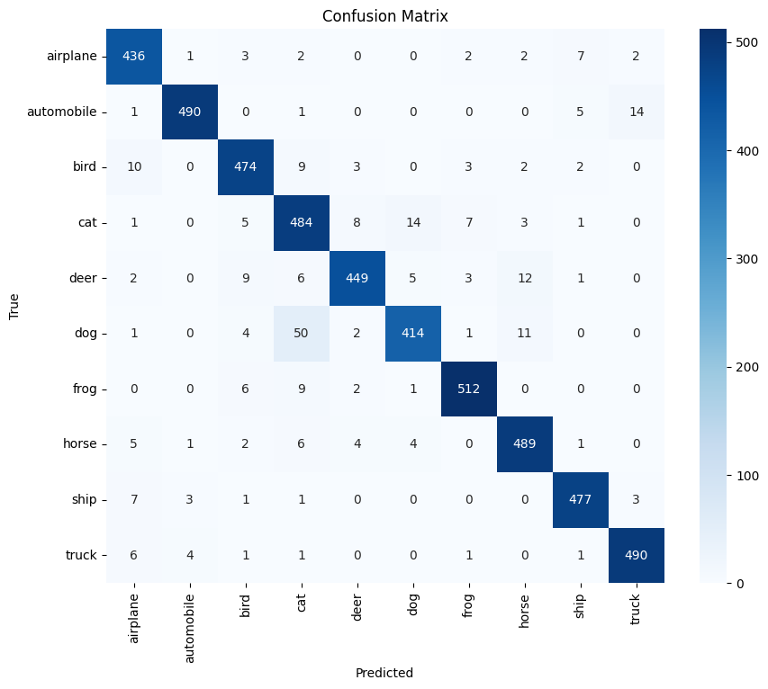
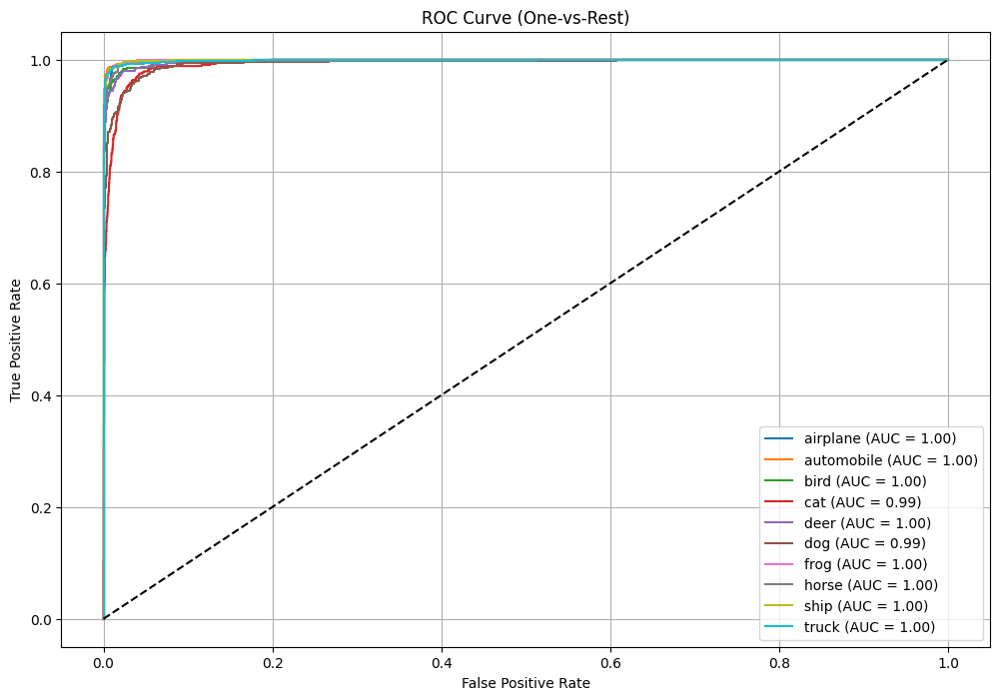

# CIFAR-10 Image Classification using ResNet-18 (Jupyter Notebook)

This project demonstrates a complete image classification pipeline on the **CIFAR-10 dataset** using **ResNet-18** and **PyTorch**, implemented entirely in a single Jupyter Notebook: `Resnet.ipynb`.

The model is trained, evaluated, and visualized with GPU acceleration, and reaches high performance (94.3% accuracy) using transfer learning and data augmentation techniques.

---

## 📌 Table of Contents

- [Overview](#overview)
- [Dataset](#dataset)
- [Notebook Features](#notebook-features)
- [Training Details](#training-details)
- [Evaluation Results](#evaluation-results)
- [Visualizations](#visualizations)
- [Installation](#installation)
- [How to Run](#how-to-run)
- [Folder Structure](#folder-structure)
- [Future Enhancements](#future-enhancements)
- [License](#license)

---

## 🔍 Overview

This project implements a **ResNet-18-based image classifier** on the CIFAR-10 dataset, using transfer learning from ImageNet. The notebook contains all code blocks for preprocessing, model definition, training, validation, metric computation, and visualization in one place for reproducibility and ease of demonstration.

---

## 📚 Dataset

- **Dataset**: CIFAR-10
- **Size**: 60,000 32×32 RGB images (10 classes)
- **Train/Test Split**: 50,000 training, 10,000 test images
- **Classes**:
  - airplane, automobile, bird, cat, deer, dog, frog, horse, ship, truck

To adapt to ResNet’s input size, images are resized to **224×224** using `torchvision.transforms`.

---

## 🧠 Notebook Features

The notebook `Resnet.ipynb` contains:

- 📦 Data loading from local CIFAR-10 batch files
- 🔁 Data augmentation (flip, crop, normalize)
- 🧠 ResNet-18 model setup using `torchvision.models`
- 🔥 GPU-accelerated training using PyTorch
- 📈 Evaluation using accuracy, precision, recall, F1-score, and ROC AUC
- 🖼️ Confusion matrix and ROC curve plots
- 💾 Model saving with `.pth` format

---

## ⚙️ Training Details

| Attribute            | Value              |
|----------------------|--------------------|
| Model                | ResNet-18 (pretrained) |
| Input Image Size     | 224 × 224 × 3      |
| Epochs               | 10                 |
| Optimizer            | Adam               |
| Batch Size           | 64                 |
| Learning Rate        | 0.001              |
| Scheduler            | ReduceLROnPlateau  |
| Augmentation         | Random crop, flip  |
| Regularization       | Weight decay (1e-5)|
| Device               | CUDA (GPU)         |

---

## 📈 Evaluation Results

| Metric                  | Score     |
|--------------------------|-----------|
| Accuracy                 | 94.30%    |
| Precision (macro avg)    | 94.42%    |
| Recall (macro avg)       | 94.27%    |
| F1-Score (macro avg)     | 94.30%    |
| ROC AUC (macro avg)      | 99.76%    |

---

## 📊 Visualizations

### Confusion Matrix



---

### ROC Curve



---

## 💾 Installation

Ensure your environment has Python 3.8+, PyTorch with CUDA support, and other dependencies.

Install requirements:

```bash
pip install -r requirements.txt
```

---

## ▶️ How to Run

1. Launch Jupyter Notebook or Jupyter Lab
2. Open `Resnet.ipynb`
3. Run all cells sequentially
4. Evaluation outputs and visualizations will be displayed inline and saved as PNGs

You can also convert the notebook to a Python script if needed:

```bash
jupyter nbconvert --to script Resnet.ipynb
```

---

## 📁 Folder Structure

```
1 - CNN/
├── Resnet.ipynb                # Main training & evaluation notebook
├── confusion_matrix.png        # Output plot
├── roc_curve.png               # Output plot
├── requirements.txt
├── README.md
└── data/
    └── CIFAR-10/               # Local batch files
```

---

## 🔮 Future Enhancements

- Use deeper models: ResNet-34, DenseNet, or EfficientNet
- Add test-time augmentation (TTA)
- Experiment with CutMix / Mixup regularization
- Deploy model as a web app using Streamlit or Flask
- Export model to ONNX or TorchScript for deployment

---

## 📜 License

This project is licensed under the MIT License.

---

## 🤝 Acknowledgments

- PyTorch and TorchVision
- CIFAR-10 dataset contributors
- ResNet paper: *"Deep Residual Learning for Image Recognition"*

---

> Created by **Tilak** | Final Year AIML Engineering Student  
> For academic submission, competition entry, and real-world portfolio use